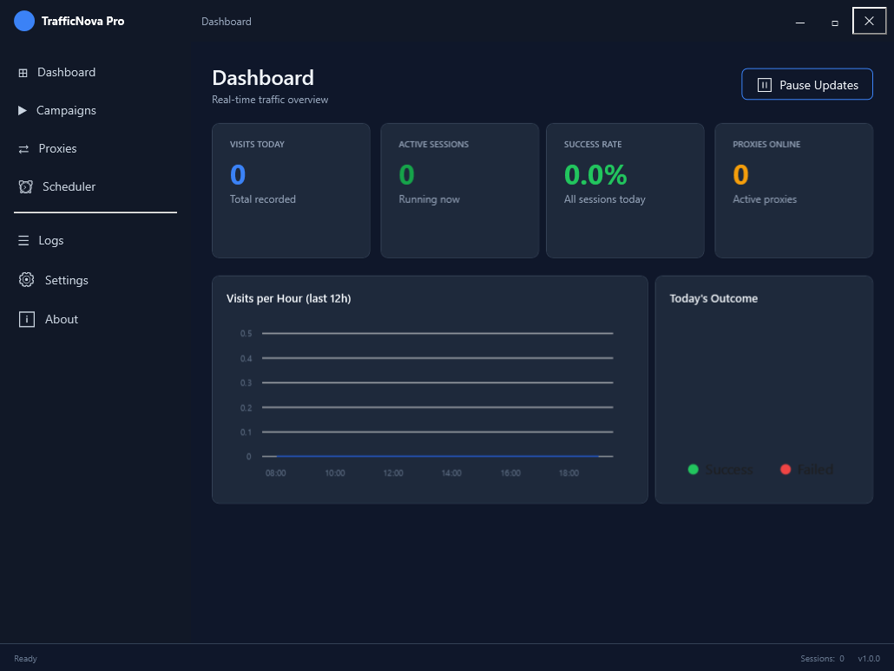
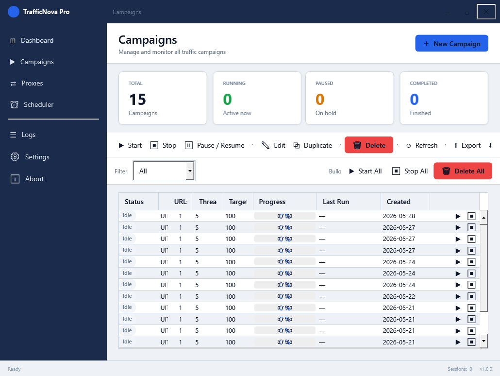
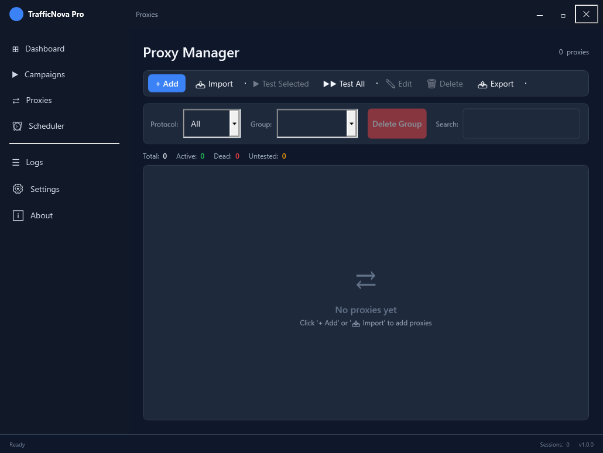
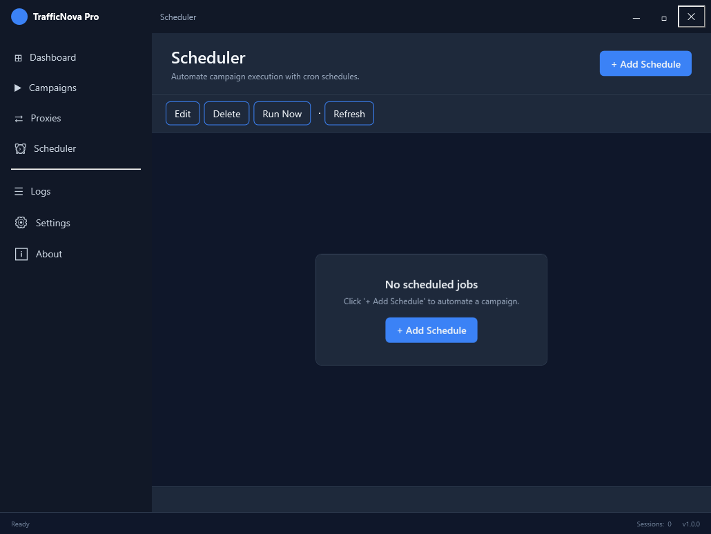
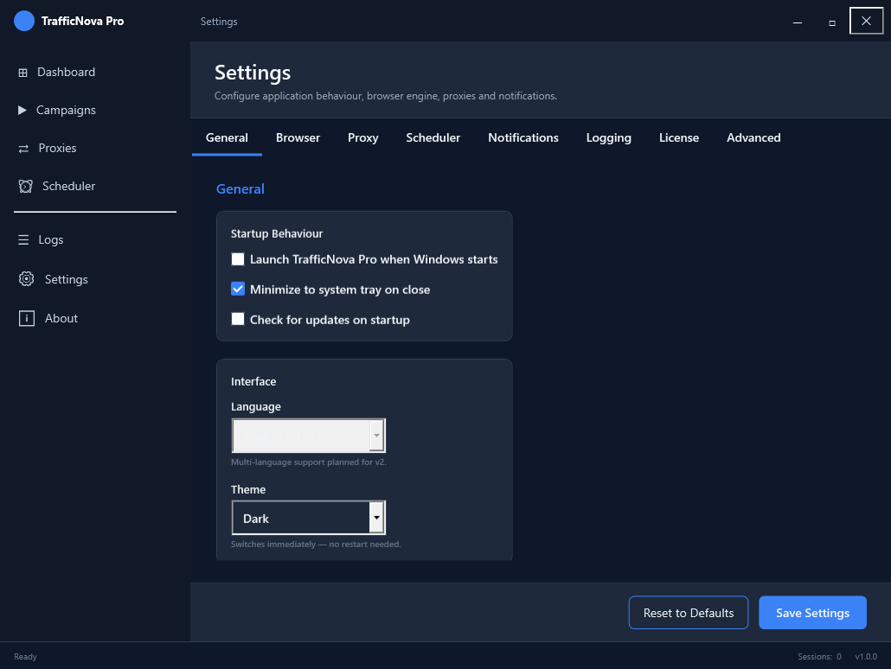
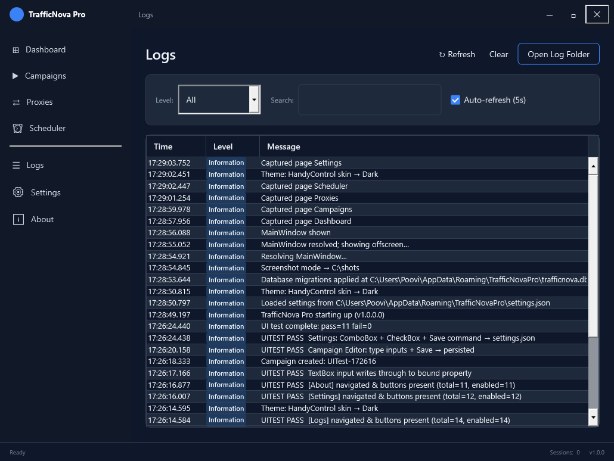

<div align="center">



# TrafficNova Pro

**Professional Web Traffic Automation — Windows Desktop**

[](https://github.com/multidigitaltools/TrafficNovaPro/releases/download/v1.0.0/TrafficNovaPro_v1.0.0_Setup.exe)
[](https://multidigitaltools.com/products/trafficnova-pro)
[](https://multidigitaltools.com/products/trafficnova-pro)

[](https://github.com/multidigitaltools/TrafficNovaPro/releases)
[](https://dotnet.microsoft.com/download/dotnet/10.0)
[](https://playwright.dev/)
[](LICENSE)
[](https://github.com/multidigitaltools/TrafficNovaPro/releases/latest)

**[🌐 Product page](https://multidigitaltools.com/products/trafficnova-pro)** &nbsp;·&nbsp; **[📖 Documentation](https://multidigitaltools.com/docs/trafficnova-pro/)** &nbsp;·&nbsp; **[💻 Source on GitHub](https://github.com/multidigitaltools/TrafficNovaPro)** &nbsp;·&nbsp; **[💬 Support](mailto:support@multidigitaltools.com)**

</div>

---

## 🆓 14-Day Free Trial

**No credit card required.** Install and use TrafficNova Pro free for 14 days with **all features unlocked**:

| Trial Feature | Status |
|---|---|
| Unlimited campaigns | ✅ Included |
| Full proxy manager | ✅ Included |
| Live analytics dashboard | ✅ Included |
| All stealth modes | ✅ Included |
| Geo-spoofing (24 countries) | ✅ Included |
| Campaign scheduler | ✅ Included |
| Session screenshot capture | ✅ Included |
| Days of access | ✅ **14 days** |

> **After trial:** Purchase a $49 one-time license key at [multidigitaltools.com/products/trafficnova-pro](https://multidigitaltools.com/products/trafficnova-pro) and activate from **Settings → License**.

---

## ✨ Features

<table>
<tr>
<td width="50%">

### 🚀 Playwright Browser Engine
Real Chromium automation via Microsoft Playwright. Full JavaScript execution, event firing, cookie handling — indistinguishable from a real user session.

### 🌐 Geo-Spoofing (24 Countries)
Per-session locale, timezone, Accept-Language, and viewport profiles. Countries include: US, UK, CA, AU, DE, FR, JP, IN, BR, and 15 more.

### 🔌 Proxy Pool Manager
Import HTTP/HTTPS/SOCKS5 proxies in bulk (IP:Port or IP:Port:User:Pass). Auto-validate on import, background health monitor, dead-proxy alerting.

### 📊 Live Analytics Dashboard
Real-time LiveCharts2 time-series (sessions/min, success rate, bandwidth). Per-session drill-down with Playwright screenshot + trace file.

</td>
<td width="50%">

### ⏰ Cron Scheduler
GUI cron builder with timezone-aware next-occurrence preview, run-now button, max-runs enforcement, and enable/disable toggle.

### 📋 Campaign Manager
Multiple target URLs (round-robin), referrer modes (Google/Bing/Social/Custom), device emulation (Desktop/Mobile/Tablet), resource blocking (None/Media/Aggressive).

### 🔒 Local-First — No Cloud
All data lives in a local SQLite database. No session data, campaign config, or analytics ever leave your machine.

### 🛡️ Trial → Activation
14-day full-featured trial. Activate with a license key from Settings → License tab. Node-locked per machine.

</td>
</tr>
</table>

---

## 📸 Screenshots

<table>
<tr>
<td align="center">
  <br/>
  <em>Live Analytics Dashboard</em>
</td>
<td align="center">
  <br/>
  <em>Campaign Manager</em>
</td>
</tr>
<tr>
<td align="center">
  <br/>
  <em>Proxy Manager</em>
</td>
<td align="center">
  <br/>
  <em>Cron Scheduler</em>
</td>
</tr>
<tr>
<td align="center">
  <br/>
  <em>Settings (7 Tabs)</em>
</td>
<td align="center">
  <br/>
  <em>Session Logs</em>
</td>
</tr>
</table>

---

## ⬇️ Download & Install

### Option 1 — Installer (Recommended)
```
1. Download: TrafficNovaPro_v1.0.0_Setup.exe (36 MB)
2. Run as Administrator
3. Follow the setup wizard
4. Launch from Desktop shortcut or Start Menu
```

**[⬇️ Download TrafficNova Pro v1.0.0](https://github.com/multidigitaltools/TrafficNovaPro/releases/download/v1.0.0/TrafficNovaPro_v1.0.0_Setup.exe)**

### System Requirements

| Component | Requirement |
|---|---|
| **OS** | Windows 10 (build 1809) or Windows 11 (64-bit) |
| **Runtime** | [.NET 10 Desktop Runtime](https://dotnet.microsoft.com/en-us/download/dotnet/10.0) |
| **RAM** | 4 GB minimum, 8 GB recommended |
| **Disk** | 500 MB free (+ Playwright Chromium ~150 MB on first run) |
| **Internet** | Required for traffic campaigns and first-run Playwright setup |

### Install .NET 10 Desktop Runtime

TrafficNova Pro requires .NET 10. Download the installer:

| Architecture | Download |
|---|---|
| x64 (most users) | [dotnet-runtime-10.x.x-win-x64.exe](https://dotnet.microsoft.com/en-us/download/dotnet/10.0) |
| ARM64 | [dotnet-runtime-10.x.x-win-arm64.exe](https://dotnet.microsoft.com/en-us/download/dotnet/10.0) |

### First-Run Playwright Setup

On first launch, TrafficNova Pro will automatically download and install the Playwright Chromium browser (~150 MB). This is a one-time setup:

```
TrafficNova Pro → Starting first-run Playwright installation...
✓ Chromium installed at: %LOCALAPPDATA%\ms-playwright\chromium-XXXX
```

---

## 🔨 Building from Source

### Prerequisites

Install all dependencies before building:

| Dependency | Version | Download |
|---|---|---|
| .NET SDK | **10.0.300+** | [download](https://dotnet.microsoft.com/download/dotnet/10.0) |
| Git | 2.40+ | [download](https://git-scm.com/download/win) |
| Visual Studio 2022 | 17.x (optional) | [download](https://visualstudio.microsoft.com/) |
| Inno Setup 6 | 6.x | [download](https://jrsoftware.org/isdl.php) |

### NuGet Dependencies

All packages are restored automatically via `dotnet restore`. Full list:

**TrafficNova (WPF UI)**
```
HandyControl                3.5.1   — Modern WPF UI control library
CommunityToolkit.Mvvm       8.3.2   — MVVM pattern (source generators)
LiveChartsCore.SkiaSharpView.WPF  2.0.0-rc4  — Real-time analytics charts
Microsoft.Extensions.DependencyInjection  9.0.0  — Dependency injection
Microsoft.Extensions.Hosting              9.0.0  — Generic host
Serilog                     4.1.0   — Structured logging
Serilog.Sinks.File          6.0.0   — Log to rolling file
Serilog.Sinks.Debug         3.0.0   — Log to debug output
Serilog.Extensions.Logging  8.0.0   — Microsoft.Extensions.Logging bridge
EPPlus                      7.5.3   — Excel export (CSV + .xlsx)
```

**TrafficNova.Core (Domain)**
```
Microsoft.Extensions.DependencyInjection.Abstractions  9.0.0
Microsoft.Extensions.Logging.Abstractions              9.0.0
Newtonsoft.Json             13.0.3  — JSON serialization
Cronos                      0.9.0   — Cron expression parsing + next-occurrence
```

**TrafficNova.Data (EF Core + SQLite)**
```
Microsoft.EntityFrameworkCore          9.0.0
Microsoft.EntityFrameworkCore.Sqlite   9.0.0  — SQLite provider
Microsoft.EntityFrameworkCore.Tools    9.0.0  — dotnet-ef migrations
```

**TrafficNova.Engine (Playwright)**
```
Microsoft.Playwright        1.49.0  — Browser automation (Chromium/Firefox/WebKit)
```

**TrafficNova.Tests**
```
xunit                       2.9.2   — Unit test framework
xunit.runner.visualstudio   2.8.2   — VS Test Explorer integration
Microsoft.NET.Test.Sdk      17.12.0 — .NET test SDK
coverlet.collector          6.0.2   — Code coverage
```

### Clone and Build

```bash
# Clone repository
git clone https://github.com/multidigitaltools/TrafficNovaPro.git
cd TrafficNovaPro

# Restore all NuGet packages
dotnet restore TrafficNova.sln

# Build Release configuration
dotnet build TrafficNova.sln -c Release

# Run unit tests (70 tests, ~10 seconds)
dotnet test TrafficNova.Tests/TrafficNova.Tests.csproj -c Release

# Publish self-contained (win-x64, framework-dependent)
dotnet publish TrafficNova/TrafficNova.csproj -c Release -r win-x64 \
  --no-self-contained -o publish/win-x64

# Install Playwright Chromium for the engine
$env:PLAYWRIGHT_BROWSERS_PATH = '0'
dotnet tool install --global Microsoft.Playwright.CLI
playwright install chromium
```

### Build the Installer

Requires [Inno Setup 6](https://jrsoftware.org/isdl.php) installed:

```bash
# Build installer (generates dist/TrafficNovaPro_v1.0.0_Setup.exe)
"C:\Program Files (x86)\Inno Setup 6\ISCC.exe" installer\TrafficNovaPro.iss
```

---

## ⚡ Quick Start Guide

```
1. Install TrafficNova Pro (run setup wizard)
2. Launch from Desktop or Start Menu
3. Trial starts automatically — 14 days, all features
4. Proxies tab → Import your proxy list → Validate All
5. Campaigns tab → New Campaign → Configure target URL + sessions
6. Click Run Now or open Scheduler for recurring campaigns
7. Dashboard → watch live visit rate, success %, proxy health
8. Click any session row → view Playwright screenshot + trace
```

---

## 📁 Project Structure

```
TrafficNovaPro/
├── TrafficNova/              # WPF UI layer (.NET 10, WinExe)
│   ├── App.xaml(.cs)         # DI bootstrap, startup, tray icon
│   ├── MainWindow.xaml       # Shell + sidebar navigation
│   ├── Pages/                # 8 full-page views
│   │   ├── DashboardPage     # Live stats + LiveCharts2
│   │   ├── CampaignsPage     # Campaign list + bulk actions
│   │   ├── ProxiesPage       # Proxy import + health monitor
│   │   ├── SchedulerPage     # Cron job management
│   │   ├── SettingsPage      # 7-tab settings (incl. License)
│   │   ├── LogsPage          # Structured Serilog viewer
│   │   ├── SessionLogPage    # Session history + export
│   │   └── AboutPage         # Version + license status
│   ├── Dialogs/              # 9 modal dialogs
│   ├── ViewModels/           # CommunityToolkit.Mvvm VMs
│   ├── Resources/            # Colors.xaml, Styles.xaml, Fonts.xaml
│   ├── Converters/           # WPF value converters
│   └── Services/             # UI-layer services (theme, update)
│
├── TrafficNova.Core/         # Domain models + interfaces
│   ├── Models/               # Campaign, Proxy, Session, AppSettings
│   ├── Interfaces/           # IProxyService, ICampaignService, etc.
│   └── Services/             # AppSettingsService, TrialService, etc.
│
├── TrafficNova.Data/         # EF Core + SQLite
│   ├── AppDbContext.cs       # EF DbContext
│   ├── Migrations/           # 7 migrations
│   └── Services/             # CampaignService, StatsService, etc.
│
├── TrafficNova.Engine/       # Playwright browser automation
│   ├── SessionPoolService.cs # Thread pool of Playwright sessions
│   ├── BrowserSession.cs     # Single Playwright session lifecycle
│   ├── PlaywrightService.cs  # Chromium initialization
│   ├── Stealth/              # Canvas noise, WebGL spoof, UA pool
│   └── WatchdogService.cs    # Stall detection + auto-stop
│
├── TrafficNova.Tests/        # xUnit tests (70 tests)
├── TrafficNova.UiTests/      # In-process UI automation
├── installer/                # Inno Setup 6 script
│   └── TrafficNovaPro.iss
├── docs/                     # Documentation
│   └── screenshots/          # App screenshots
├── TrafficNova.sln
├── global.json               # SDK pin: 10.0.300
├── LICENSE                   # Commercial license
├── README.md
└── RELEASE_NOTES.md
```

---

## 🏗️ Architecture

```
┌─────────────────────────────────────────────────┐
│  TrafficNova (WPF UI)                           │
│  ┌──────────┐  ┌──────────┐  ┌───────────────┐ │
│  │ Dashboard│  │Campaigns │  │Proxy Manager  │ │
│  │ (Charts) │  │(DataGrid)│  │(Health Monitor│ │
│  └────┬─────┘  └────┬─────┘  └──────┬────────┘ │
│       └──────────────┴───────────────┘          │
│                    ▼                            │
│            DI Container (MS.Extensions)         │
└──────────────────┬──────────────────────────────┘
                   │
         ┌─────────┼─────────┐
         ▼         ▼         ▼
  ┌──────────┐ ┌────────┐ ┌───────────────┐
  │Core      │ │Data    │ │Engine         │
  │(Models + │ │(EF Core│ │(Playwright    │
  │Services) │ │+SQLite)│ │+SessionPool)  │
  └──────────┘ └────────┘ └───────────────┘
                                 │
                          ┌──────▼──────┐
                          │  Chromium   │
                          │ (Playwright)│
                          └─────────────┘
```

---

## 💰 Pricing & License

| | Free Trial | Pro License |
|---|---|---|
| **Duration** | 14 days | Lifetime |
| **Price** | $0 | **$49** one-time |
| **All features** | ✅ | ✅ |
| **Updates (v1.x)** | ✅ | ✅ |
| **Machines** | 1 | 1 (node-locked) |
| **Cloud dependency** | None | None |

**Compare vs monthly SaaS:**
- SerpClix: $197/month → TrafficNova pays for itself in **<1 week**
- Babylon Traffic: $39–$199/month → saves **$420–$2,340/year**

**[🛒 Buy License — $49](https://multidigitaltools.com/products/trafficnova-pro)**

---

## 🔒 Security & Privacy

- **No telemetry.** Zero analytics or crash reports sent anywhere.
- **No cloud.** All campaigns, proxies, and session data stay on your machine in a local SQLite database (`%APPDATA%\TrafficNovaPro\trafficnova.db`).
- **License activation** is client-side (no server call) — a valid-format key sets `IsActivated = true` in local settings.
- **Chromium isolation** — each campaign session runs in an isolated Playwright browser context.

---

## 🐛 Known Limitations (v1.0.0)

| Limitation | Workaround / ETA |
|---|---|
| Proxy chain (double-hop) is UI stub | v1.1 |
| FlareSolverr requires separate local instance | See [FlareSolverr](https://github.com/FlareSolverr/FlareSolverr) |
| Auto-update downloads update, not installs | Manual reinstall required |
| Mobile emulation uses UA + viewport (not real device) | By design |

---

## 📞 Support

| Channel | Link |
|---|---|
| 🌐 Product page | [multidigitaltools.com/products/trafficnova-pro](https://multidigitaltools.com/products/trafficnova-pro) |
| 📖 Docs portal | [multidigitaltools.com/docs/trafficnova-pro/](https://multidigitaltools.com/docs/trafficnova-pro/) |
| 📧 Email | support@multidigitaltools.com |
| 🐛 Bug reports | [GitHub Issues](https://github.com/multidigitaltools/TrafficNovaPro/issues) |

---

## 📋 Changelog

### v1.0.0 — 2026-06-02
- Initial public release
- Microsoft Playwright 1.x engine (Chromium)
- Campaign manager with geo-spoofing, referrer simulation, device emulation
- Proxy manager with auto-validate + health monitor
- Live analytics dashboard (LiveCharts2)
- Cron scheduler with GUI builder
- Session detail viewer (screenshot + trace)
- Resource bandwidth blocking (None/Media/Aggressive)
- 14-day trial with license activation
- Inno Setup 6 installer

See [RELEASE_NOTES.md](RELEASE_NOTES.md) for full notes.

---

<div align="center">

[](https://github.com/multidigitaltools/TrafficNovaPro/releases/download/v1.0.0/TrafficNovaPro_v1.0.0_Setup.exe)
[](https://multidigitaltools.com/products/trafficnova-pro)
[](https://github.com/multidigitaltools/TrafficNovaPro)

Made by **[MultiDigitalTools](https://multidigitaltools.com)** · Copyright © 2026 · All Rights Reserved

</div>
